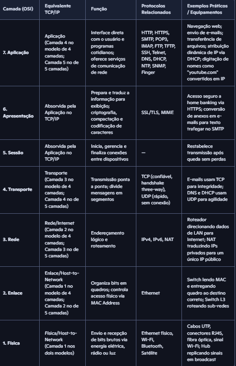

# The-Architecture-and-Fundamentals-of-Computer-Networks

> Caderno Temático criado com NotebookLM para o Desafio DIO.

---

### 1. Contexto e Objetivos

**Assunto escolhido:** Foundations and Architecture of Computer Networks.

Escolhi este tema porque é a base de toda a TI e eu precisava transformar conteúdo solto em material de estudo ativo. O objetivo foi criar um caderno que fosse desde o físico (dispositivos finais, roteadores, meios de conexão) até o lógico (OSI, TCP/IP, DNS, HTTP, IPv4/IPv6), usando IA como tutora.

**Objetivos:**
1. Solidificar conceitos de redes, classificação PAN/LAN/MAN/WAN e topologias
2. Entender na prática HUB, SWITCH e Roteador
3. Dominar OSI/TCP/IP, Endereçamento IP, Ethernet e Sub-redes com cálculos reais

### 2. Curadoria de Fontes

5 fontes em vídeo carregadas no NotebookLM:

1. https://www.youtube.com/watch?v=q0S75nKpmcw&t=33s
2. https://www.youtube.com/watch?v=KOrWZnGbx7s
3. https://www.youtube.com/watch?v=gMzka2WM80k
4. https://www.youtube.com/watch?v=BmBPhA5b-Lc&t=82s
5. https://www.youtube.com/watch?v=h_qeUwWGyTE

### 3. Engenharia de Prompts e "Cicatrizes"

**PROMPT 1 — Resumo Estruturado (o que você acabou de rodar):**
> Com base exclusivamente nas fontes selecionadas neste notebook, elabore um resumo estruturado sobre os fundamentos das redes de computadores. Organize nos tópicos: Conceito, Topologias, Modelo OSI, Modelo TCP/IP, Endereçamento IP, Protocolos, Switches e roteadores, Ethernet, Sub-redes. Não invente informações.

**Resposta obtida:** 1. Conceito de Redes
Conjunto de equipamentos interconectados.

Dispositivos finais (hosts): computadores, celulares, tablets, impressoras, TVs, Alexa.

Dispositivos intermediários: switches e roteadores.

Meios de conexão:

Guiados → cabos UTP, fibra óptica.

Não guiados → Wi-Fi, Bluetooth, satélite.

Classificação: PAN (fone Bluetooth), LAN (residência), MAN (cidade), WAN (Internet).

Exemplo prático: LAN doméstica acessando YouTube, Google Drive, Instagram ou jogos online.

2. Topologias de Rede
Organização física da comunicação.

Modelos:

Anel → caminho fechado.

Barramento → único barramento compartilhado.

Estrela → ponto central conecta todos.

Malha → todos conectados entre si.

3. Modelo OSI
Modelo teórico de 7 camadas (ISO).

Encapsulamento/desencapsulamento: envio e recepção de dados.

Mnemônico ASTRA F:

Física → bits, cabos UTP, RJ45, Hub.

Enlace → frames, MAC, Switch.

Rede → pacotes, IP, roteador.

Transporte → TCP/UDP.

Sessão → gerencia conexões.

Apresentação → criptografia SSL/TLS, MIME.

Aplicação → HTTP, SMTP, FTP, DNS, DHCP.

4. Modelo TCP/IP
Pilha prática da Internet.

Visões:

4 camadas (Tanenbaum).

5 camadas (Kurose/Forouzan).

Camadas: Física, Enlace, Rede (Internet), Transporte, Aplicação.

Sessão e Apresentação absorvidas pela Aplicação.

5. Endereçamento IP
Endereço lógico (Camada 3).

IPv4: 32 bits, 4 octetos (192.168.0.1).

IPv6: 128 bits, hexadecimais, espaço maior.

IP Público vs Privado:

Privados: 10.0.0.0/8, 172.16.0.0/12, 192.168.0.0/16.

NAT: traduz vários privados para 1 público.

Histórico Classes: A (/8), B (/16), C (/24), D (multicast), E (futuro). Substituído por CIDR.

6. Protocolos de Comunicação
Conjunto de regras padronizadas.

Transporte:

TCP → confiável, handshake SYN/SYN-ACK/ACK, unicast.

UDP → rápido, não confiável, suporta unicast/multicast/broadcast.

Aplicação:

HTTP/HTTPS (web + SSL/TLS).

SMTP + MIME (e-mail).

POP3 (destrutivo), IMAP (não destrutivo).

FTP/TFTP (arquivos).

SSH (seguro), Telnet (texto puro).

DNS (UDP consultas, TCP zonas).

DHCP (IP automático via broadcast).

NTP (sincronização de hora).

SNMP (gerência de rede).

7. Switches e Roteadores
Hub (Camada 1): burro, replica sinais em broadcast.

Switch (Camada 2): inteligente, lê MAC, entrega só ao destino.

Switch L3: agrega funções de roteador.

Roteador (Camada 3): interliga redes diferentes, lê IP, gateway padrão, escolhe melhor caminho. Pode ter Wi-Fi AP.

8. Ethernet
Padrão cabeado mais comum em LAN.

Usa cabos UTP e conectores RJ45.

Atua nas camadas Física e Enlace.

9. Sub-redes
Subdivisão de rede com máscara.

CIDR: /8, /16, /24.

Regras:

Rede = primeiro IP.

Broadcast = último IP.

Válidos = entre os dois.

Cálculo:

Total = 
2
𝑏
𝑖
𝑡
𝑠
_
ℎ
𝑜
𝑠
𝑡
.

Válidos = 
2
𝑏
𝑖
𝑡
𝑠
_
ℎ
𝑜
𝑠
𝑡
−
2
.

Exemplos:

/8 → 16.777.214 hosts válidos.

/16 → 65.534 hosts válidos.

/24 → 254 hosts válidos.

**PROMPT 2 — Comparação OSI x TCP/IP:**
> Com base nas fontes, compare OSI e TCP/IP. Crie tabela com Modelo, Camadas, Função, Protocolos, Exemplos. Ao final, explique por que é importante para profissionais de redes.

**Resposta:** 

**PROMPT 3 — Troubleshooting:**
> Crie um cenário prático de troubleshooting com Windows e Linux. Explique Sintoma, Hipóteses, Testes, Comandos, Análise, Causa raiz, Solução, Validação. Como profissional de NOC.

**Resposta:** TICKET INC-20260901-08: Windows 192.168.1.10/24 não conecta via SSH no Linux 192.168.0.11/24. Causa: sub-rede distinta. Solução: DHCP para 192.168.0.10/24 e validação com handshake TCP SYN/SYN-ACK/ACK.

**PROMPT 4 — Aprendizagem Ativa:**
> Crie 15 perguntas (5 básicas, 5 intermediárias, 5 avançadas) usando só as fontes. Não mostre respostas. Aguarde minhas respostas e avalie.

**Resposta:** Conjunto de flashcards e quiz gerados no Estúdio, permitindo prática ativa e avaliação de desempenho.

**PROMPT 5 — Glossário:**
> Com base nas fontes, crie um glossário com 20+ termos. Para cada: Termo, Definição, Função, Exemplo. Ordem alfabética.

**Resposta:** Glossário com 24 termos: 

Access Point

Broadcast

Bridge

Cabo UTP

CIDR

DHCP

DNS

FTP

Gateway

Host

HTTP

Hub

IMAP

IP

MAC

MIME

NAT

NTP

POP3

Roteador

SSH

Switch

TCP

UDP

### 4. Miniguia de Estudo (Entrega Final)

#### A) Resumos estruturados

**1. Conceito:** Conjunto de equipamentos interconectados. Hosts (PCs, celulares, Alexa, impressoras, TVs) + intermediários (switches, roteadores). Meios guiados (UTP, fibra) e não guiados (Wi-Fi, Bluetooth, satélite). Classificação: PAN (fone Bluetooth), LAN (residência), MAN, WAN (Internet). Ex: LAN doméstica com roteador para acessar YouTube, Drive, Instagram, jogos como LoL/Free Fire.

**2. Topologias:** Organização física. Cliente-servidor ou mesh. Modelos: Anel (caminho fechado), Barramento (barramento único compartilhado), Estrela (ponto central), Malha (todos conectados).

**3. Modelo OSI:** Modelo teórico ISO 7 camadas para interoperabilidade. Encapsulamento (desce adicionando controle) e desencapsulamento (sobe). Mnemônico ASTRA F: Física (bits, UTP, RJ45, Hub), Enlace (frames, MAC, Switch), Rede (pacotes, IP, roteamento, Roteador), Transporte (TCP/UDP), Sessão (gerencia/restabelece), Apresentação (criptografia SSL/TLS, MIME), Aplicação (HTTP, SMTP, FTP, DNS, DHCP).

**4. Modelo TCP/IP:** Pilha prática da Internet. Visão 4 camadas (Tanenbaum) ou 5 camadas (Kurose/Forouzan): Física, Enlace, Rede/Internet, Transporte, Aplicação. Sessão e Apresentação são absorvidas pela Aplicação.

**5. Endereçamento IP:** Endereço lógico Camada 3, diferente do MAC físico de fábrica. IPv4: 32 bits, 4 octetos 0-255 (192.168.0.1), limite 4,3 bi. IPv6: 128 bits hex, maior espaço. IP Público (Internet) vs Privado (LAN): 10.0.0.0/8, 172.16.0.0/12, 192.168.0.0/16. NAT traduz vários privados para 1 público. Classes históricas até 1993: A (/8 - 16.777.216 hosts), B (/16 - 65.536), C (/24 - 254 hosts), D (multicast), E (futuro). Substituído por CIDR em 1993.

**6. Protocolos:** Regras padronizadas. TCP (confiável, handshake SYN/SYN-ACK/ACK, só unicast), UDP (não confiável, rápido, unicast/multicast/broadcast). HTTP/HTTPS (web + SSL/TLS), SMTP/MIME/POP3/IMAP (e-mail), FTP (porta 20 dados/21 controle), TFTP, SSH (criptografado), Telnet (texto puro), DNS (UDP consulta/TCP zona), DHCP (distribui IP/máscara/gateway/DNS via broadcast), NTP (hora/logs), SNMP (gerência).

**7. Switches e Roteadores:** Hub L1 burro (replica para todas portas em broadcast, lento/inseguro), Switch L2 inteligente (lê MAC, tabela de portas, entrega só no destino, LAN), Switch L3 (com função de roteador). Roteador L3 (interliga redes diferentes, lê IP, Gateway padrão, escolhe melhor caminho, pode ter Wi-Fi Access Point).

**8. Ethernet:** Padrão cabeado mais comum LAN. Usa cabo UTP e conector RJ45. Atua nas camadas Física e Enlace.

**9. Sub-redes:** Subdivisão com máscara. Máscara indica ID Rede e ID Host. CIDR: /8=255.0.0.0, /16=255.255.0.0, /24=255.255.255.0. Regras: Rede=primeiro IP (bits host 0), Broadcast=último (bits host 1/255), Válidos=meio. Cálculo: Total=2^bits_host, Válidos=2^bits_host-2. Ex: 50.0.0.0/8 (50.0.0.1 a 50.255.255.254 - 16.777.214 hosts), 130.250.0.0/16 (65.534 hosts), 210.30.40.0/24 (210.30.40.1 a .254 - 254 hosts).

#### B) Glossário (20+ termos)
Ver PROMPT 5 completo acima - 24 termos de Access Point a UDP com definição, função e exemplo prático (ex: DHCP perguntando em broadcast "Quem é o servidor DHCP?").

#### C) Prompts reutilizáveis
1. `Com base nas fontes, compare OSI e TCP/IP em tabela com Modelo, Camadas, Função, Protocolos e Exemplos`
2. `Crie um cenário de troubleshooting NOC com Windows 192.168.1.10/24 vs Linux 192.168.0.11/24 - mostre causa raiz de sub-rede e solução via DHCP`
3. `Crie 15 perguntas (5 básicas, 5 int., 5 avanç.) sobre redes usando só as fontes e me avalie depois`
4. `Gere um glossário alfabético com 20+ termos com Termo, Definição, Função e Exemplo prático`
5. ### 📎 Comprovação
- Flashcards: https://notebook.google.com/notebook/d678112a-30f5-4dc7-9688-2c7dcc06f076/artifact/bb924a0d-ec8d-4a33-a039-1faf7df2abd7
- Mapa: https://notebook.google.com/notebook/d678112a-30f5-4dc7-9688-2c7dcc06f076/artifact/245268a9-ff20-42c0-aaa9-86261b0c59b0
- Quiz: https://notebook.google.com/notebook/d678112a-30f5-4dc7-9688-2c7dcc06f076/artifact/48c87b0f-8645-4217-9a0d-47248e0c877c
